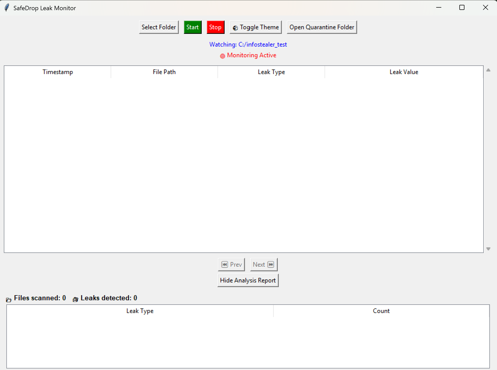
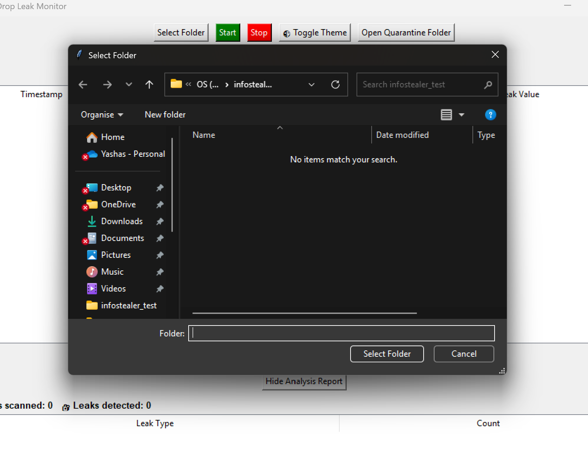
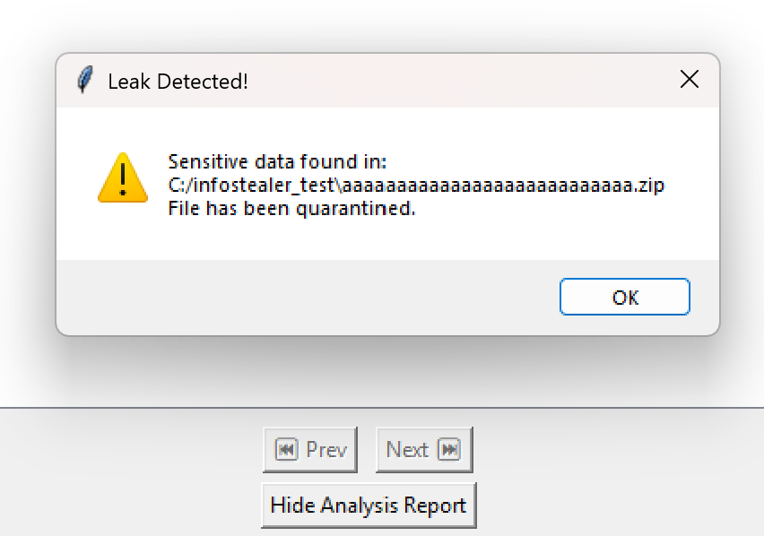
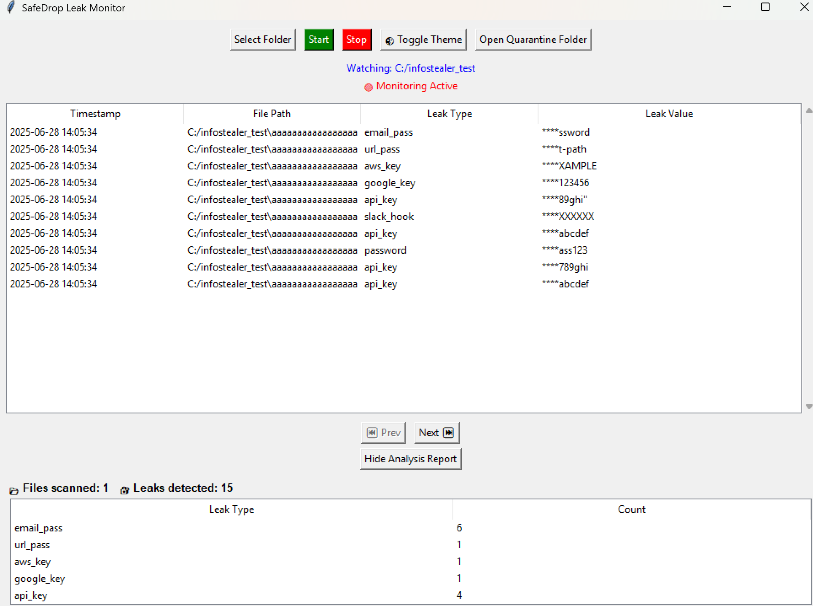
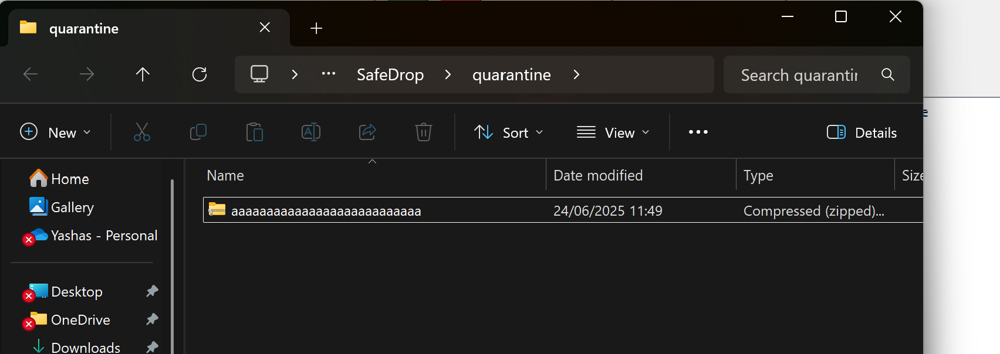
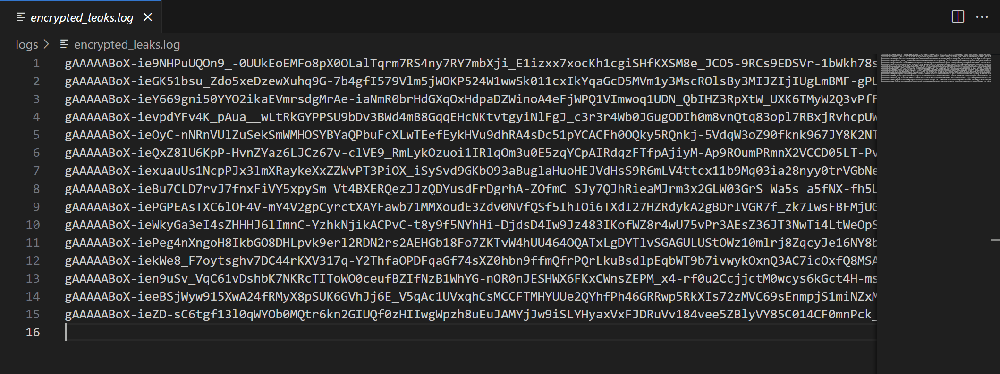
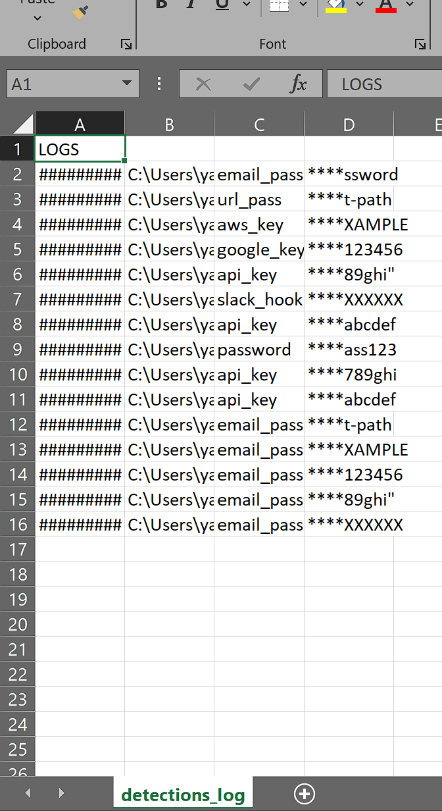
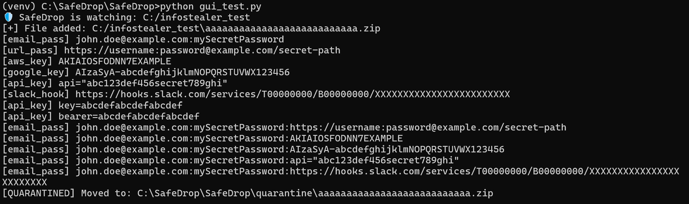

# SafeDrop 🔐  
**Sensitive Data Leak Detector with Multi-File Support and GUI**  

SafeDrop is a lightweight desktop tool designed to detect sensitive information leaks (API keys, passwords, emails, webhooks, etc.) across various file formats. It supports automated folder monitoring, leak detection, alert popups, quarantining suspicious files, encrypted logging, and a powerful GUI for visualization and interaction.

---

## 🧩 Features  
- ✅ **Multi-format support**: `.txt`, `.pdf`, `.docx`, `.json`, `.env`, `.log`, `.csv`, `.zip`  
- 🔍 **Regex-based leak detection** using highly customizable and robust patterns  
- 📁 **Folder Monitoring**: Real-time scan of folders and subfolders  
- 💥 **Leak Alerts**: Popup warning + quarantine of suspicious files  
- 🧼 **Sanitized Output**: Masked display of detected values  
- 🔐 **AES-256 Encryption**: Encrypted leak logs  
- 📊 **Detailed GUI Dashboard**:  
  - File path, timestamp, leak type, and masked value  
  - Analysis report grouped by leak type  
  - Pagination and collapsible reports  
- 🎨 **Dark/Light Toggle Theme**  
- 📦 **Quarantine Folder Access**  
- ✅ **Unit-tested handler modules**  

---

## 🖥️ Screenshots  

| GUI Dashboard | Folder Picker |
|---------------|----------------|
|  |  |

| Leak Detection Popup | Detection Summary |
|----------------------|-------------------|
|  |  |

| Quarantined File | Encrypted Logs | CSV Log |
|------------------|----------------|---------|
|  |  |  |

| Terminal Output |
|-----------------|
|  |

---

## ⚙️ Setup & Installation  

### 📦 Clone the Repo  
```bash
git clone https://github.com/yashaskl2110/SafeDrop.git
cd SafeDrop

Create a Virtual Environment (Recommended)
python -m venv venv
# Activate (Windows)
venv\Scripts\activate

Install Dependencies
pip install -r requirements.txt
If requirements.txt is missing, install manually:
pip install customtkinter pycryptodome python-docx PyPDF2 watchdog

🔐 Encryption Setup
AES encryption is used for log safety.
Key is auto-generated in key.key
Encrypted logs stored in logs/encrypted_leaks.log
Sanitized CSV logs stored in logs/detection_logs.csv

🚀 Running the App
🖱️ GUI Mode
bash
python gui/gui.py
🧪 Run Unit Tests
bash
pytest tests/

🗂️ Project Structure
SafeDrop/
│
├── core/
│   ├── detectors.py           # Regex match logic
│   ├── utils.py               # Encryption, logging, helpers
│
├── handlers/                 # File-specific detection handlers
│   ├── txt_handler.py
│   ├── pdf_handler.py
│   ├── docx_handler.py
│   ├── json_handler.py
│   ├── csv_handler.py
│   ├── env_handler.py
│   ├── log_handler.py
│   ├── zip_handler.py
│
├── gui/
│   └── gui.py                 # CustomTkinter GUI interface
│
├── tests/
│   ├── test_csv_handler.py    # Sample unit tests
│   ├── ...
│
├── logs/
│   ├── detection_logs.csv     # Sanitized leak logs
│   ├── encrypted_leaks.log    # Encrypted logs (AES)
│
├── quarantine/               # Quarantined suspicious files
│
├── requirements.txt
├── key.key                   # AES key file
└── README.md

🧠 How It Works
User selects a folder to monitor
Every file (including inside ZIPs) is scanned using format-specific handlers
If sensitive content is found:
GUI displays timestamped result
Masked value shown in table
Logs are saved (sanitized & encrypted)
File is moved to quarantine/
Alert popup is triggered

🔒 Leak Types Detected
email_pass: Email:Password combo
aws_key: AWS Access Key
google_key: Google API Key
slack_hook: Slack Webhook
api_key: Generic API Key or Token
url_pass: URLs with embedded passwords
.env variables: SECRET_KEY, DB_PASS, etc.

👨‍💻 Author
Built with ❤️ by Yashas Kumara Lakawath

📄 License
This project is licensed under the MIT License. See LICENSE for details.
